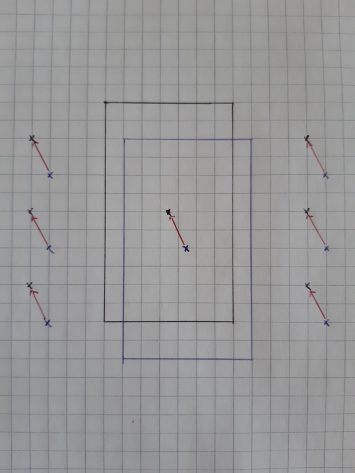

# Hexapod
## Summary
This repository contains 2 catkin packages.  

`core` provides a library to control a hexapod type robot. It has been written with microcontrollers in mind so does not use any of the standard library, and uses about 2.5K of RAM when compiled for size using avr-gcc. It is able to run at about 20Hz on an Atmega644p.  
The main aim was to provide flexible and smooth control of all types of movement simultaneously. The hexapod can walk in any direction, while turning, while moving it's body through 6DoF. The leg height, stride length and stance width (and other things) are all adjustable and the hexapod will update naturally whether stationary or moving, and it can change between different gaits while moving.  
The various movement parameters (mainly set in `updateMovementParameters`, `setUpdateFrequency`, `setMovementIncrements` functions) should adjust to the dimensions of the robot, but they have been tested using the `PhantomX` model and may need adjustment for others.  

The structure of the robot is also very configurable (explained further below), **including the number of legs**, their positions and dimensions.

`vis` provides additional code for visualisation using ROS and RViz. `demo.launch` shows a preset demo of movements, and `control.launch` provides keyboard control of the hexapod (the controls are printed on the screen). There are also several urdf examples provided - a robot of the appropriate configuration is derived and built automatically from the urdf.

## Visualisation demo
https://youtu.be/P0InG3q7VjE  

## Build
Clone into catkin worspace and then build using catkin (here I'm using python catkin tools)
```sh
mkdir -p catkin_ws/src
cd catkin_ws
git clone https://github.com/matt769/Hexapod.git src/hexapod
catkin build
```

## Run
In `catkin_ws`
```sh
source /opt/ros/melodic/setup.bash  # if not done already
source devel/setup.bash
roslaunch hexapod control.launch
```

## Core movement concepts
The below describes how the robot operates in WALKING mode. This is the main mode of operation and despite the name, also includes standing completely still, or standing still and only moving its body.


### Base frame and body frame
The `base` frame is always level with the ground plane and at a fixed height above it with its x-axis pointing forward. It is not fixed to the physical body of the robot. All movements (walking direction, body tilting etc) are defined with respect to this frame.  
The `body` frame is fixed to the physical body of the robot (located in the centre) and so moves as the body moves.  
Some types of movement involve moving the `base` frame e.g. walking, and other types only involve moving the `body` frame relative to the `base`.  

The robot maintains the current `base` to `body` transformation. Cumulative movement of the `base` itself is not tracked since the robot does not know where it is in the real world (the visualisation does track this though). Technically, since the robot has no sensors at all, it cannot actually know where the `body` is in relation the the `base` but given that it controls the leg joint angles which determine this, I believe it is reasonable to assume this transformation is known.

Foot positions are **always** calculated with respect to the `base`.  


### Stationary movement - body only
Movement of `body` relative to `base`. Movement while stationary is not handled any differently to walking but since the `base` is not moving, legs will not be raised (more details later). Due to numerical error when recalculating the new foot position in the leg frame after body movement, legs may occasionally be raised (and then put down in almost the same place).

The below pictures show the `base`, `body` and all 6 `foot` frames. We can see that the `body` frame and physical body of the robot move relative to the `base` frame and the physical `feet` which do not move (though their orientation may change, their position will not).

1a) Base and body aligned

1b) Body is translated - base and feet (position only) are unchanged

2a) Base and body aligned (alternate view)

2b) Body is translated and rotated relative to the base - base and feet (position only) are unchanged


### Neutral position
The `neutral` position of a foot is fixed relative to the `base`. When the robot is stationary its feet will all be in their neutral positions (or moving towards it if only just stopped walking). This position can be changed but as a default is located a fixed distance to the side from the base of the leg (and assuming there is no `body` movement) and on the ground. `body` movement does **not** affect the `neutral` postition.


### Walking
Walking or turning is considered a movement of the `base`. Based on the speed, direction and rotation desired, we define a change in the `base`, relative to its current pose. To achieve this desired `base` position (i.e. movement), any legs on the ground must update their joints to accomodate this new position.

It is important to observe in general that while walking, what we need to make decisions about is when to lift a leg up, and where/when to put it down. Legs on the ground just need to be updated to maintain the required relationship between `base` and `foot`.

#### When to lift the foot
When a foot can or should lift off the ground is defined by the gait sequence (the order in which the legs should lift), how many legs are currently on the ground and how many are allowed to be lifted at once (implicitly defined by the offset). It is not based on position.  

#### When to put the foot down
Previously, the time taken to move a foot in the air was calculated based on the required movement speed, so as movement gets faster, the legs move faster while raised. However, there were several complications with this set up. In some refactoring done before working with a physical robot, the time a foot spends in the air was changed to be constant (but user controllable) as this simplified several things. I may probably change it at least partly back in the future as it gives a more 'natural' look. 
#### Where to put the foot down
All `base` movements have an associated `foot movement vector`. This vector can be calculated as the change in `neutral` position of the foot for a given change in the `base`. The current foot position is irrelevant. The below images show examples for a translation, a rotation, and both together. In practice, each movement step will be much smaller than shown in the example.  


  

The `target foot position` is some distance ahead of the `neutral` position along the `foot movement vector` as shown in the below image. This distance is defined by the allowed range of the foot. Note that the position of the foot before it leaves the ground is not a factor at all (except in the situation where the current position and target are the same, in which case the leg raise movement is skipped).  
  

Using this vector based approach to describe movement makes it fairly trivial to produce motion in any direction, and to blend different motions (e.g. translation and rotation). 

### Current limitations
The implementation assumes that the ground is completely flat. It has no sensors and no way of knowing if a leg is actually on the ground, so it puts them where it believes the (flat) ground to be.  

No consideration of whether legs may collide, though this can be eliminated by adjusting `stride length` if required.


## Transformations
TODO  
Describe main calculations  

## Forward kinematics
Where a, b, c are the link lengths from the leg base to the foot, theta_1, 2, 3 are the joint angles and x, y, z is the foot position in the leg frame, as described in the below image.
  

So the formulae to calculate the foot position from the joint angles are as follows:  
h = a + b * cos(theta_2) + c * cos(theta_2 + theta_3)  
x = h * cos(theta_1)  
y = h * sin(theta_1)  
z = b * sin(theta_2) + c * sin(theta_2 + theta_3)  


## Inverse kinematics
The formulae to calculate the joint angles from the foot position are as follows (not taking into account joint limits for the moment):  

theta_1 = atan2(y, x) +/- pi  
k = (x / cos(theta_1)) if cos(theta_1) > |sin(theta_1)| , else (y / sin(theta_1))  
theta_3 = +/- acos((z^2 + k^2 -b^2 -c^2) / (2 * b * c))  
i = b + c * cos(theta_3)  
j = c * sin(theta_3)  
theta_2 = atan2(z, k) - atan2(j, i)  

TODO upload full derivation


## How to control
From a starting position with the body on the ground, call `setLegsToGround()` (once), and `update()` periodically until `getState()` returns Hexapod::State::STANDING.  
Then call `riseToWalk()` and `update()` periodically until `getState()` returns Hexapod::State::WALKING.  

The robot can then be controlled primarily using the `changeBody()` and `setWalk()` functions. The `update()` function should be called for every 'small' time step. In these examples it's done at 50hz.  

Other aspects of its movement can be changed through the public functions.  

```
bool clearMovement();
bool resetBody();
void clearTargets();
bool changeStanceWidth(float change);
bool resetStanceWidth();
bool changeGait(Gait gait);
bool setFootGroundTravelRatio(float ratio);
bool changeFootGroundTravelRatio(float change);
bool resetFootGroundTravelRatio();
bool setLegRaiseHeight(float height);
bool changeLegRaiseHeight(float change);
bool resetLegRaiseHeight();
void setMoveMode(MoveMode move_mode);
etc etc
```

## How to build a robot
### Using the constructor directly
There are several provided examples of how to do this, See the `buildDefault...()` example functions in `core/src/hexapod.cpp`.  

```c++
Hexapod(size_t num_legs, Dims hex_dims, Tfm::Transform* tf_body_to_leg, Leg* legs, uint16_t update_frequency);
```
num_legs - Number of legs for the robot to have. Must be an even number.  
hex_dims - Hexapod dimensions (struct available from Hexapod class): length, width, depth. Depth is in fact the only dimension currently used and will be used to set the starting height of the `base` frame (depth/2 above 0).  
tf_body_to_leg - An array of transformations describing the pose of the base of each leg with respect to the `body` frame (remember `body` frame is same as the `base` frame at start up).  
legs - An array of Leg objects - more details below.  
update_frequency - how often update() will be called (per second). This is used to help set some (relatively) sensible movement parameters.  

Both arrays must of course be the same length as the number of legs, and the order **must** be as follows:  
 - first row (front) left leg
 - same row right leg
 - next row left leg
 - same row right leg
 - ...
 - back row left leg
 - same row right leg

So there is an assumption that all legs come in pairs that are opposite each other. This does not need to be strictly adhered to when defining the body to leg transforms, but it is assumed by the gait calculations so if that assumption if not held then it might produce odd walking styles.


```c++
Leg(Dims dims, Joint* joints);
```
dims - Leg dimensions (struct available from Hexapod class): where a, b, c are the link lengths between joints.  
joints - An array of Joint objects to use for that leg.  
There is also a default constructor that can be used to create an array of Leg objects.  

**Assumption** - if the leg is fully stretched out, the foot will be located directly along the x-axis of the leg base frame, at distance a+b+c (no offsets in y or z).  


### Build robot based on the URDF file
You can build the core robot using `BuildFromURDF()` function in the `vis` package. This will parse the URDF file loaded to the ROS parameter server and named `robot_description`, and call the Hexapod constructor with the appropriate arguments.  

Note that the leg naming convention must be maintained as the visualisation code makes some assumptions on it. The names must adhere to the order described above when arranged in alphabetical order.  

See the example URDF files in `vis/urdf`.  

```sh
roslaunch hexapod control.launch model:=vis/urdf/hexapod2.urdf.xacro
```
 


```sh
roslaunch hexapod control.launch model:=vis/urdf/octapod.urdf.xacro
```
 


```sh
roslaunch hexapod control.launch model:=vis/urdf/sillypod.urdf.xacro
```
 


## Todo / Future (in no particular order)
 - Review the way in which legs move while raised. It's got overly complicated. Could probably be simplified.
   - I've improved it but it could probably still benefit from overhaul.
 - Better definition of allowed foot movement range.
 - Foot sensors to determine when a foot has actually touched the ground. This would help to allow handling of non-flat terrain.
 - IMU to determine actual body pose.
 - Get the PhantomX urdf representing the full physical model (including axis flips and maybe adding the meshes), and buildFromUrdf() can produce a correct model from it
 - Is there a better way to manage multiple receiver types? And different settings for different models?
 - Review Hexapod and Leg interfaces - they're a bit messy, especially with physical and model version of various set/get angles type functions. Should Joint even support the mapping to 'physical', or should that be outside the hexapod model entirely?
 - How to better define the allowed movement range. Currently it's quite restrictive.
 - Make gait offset parameter controllable?
 - Better way of handling or preventing situations where positions are not achievable
 - Currently includes a variable length array (depending on number of legs) in some of the setup functions. Supported by gcc / avr-gcc but perhaps not ideal (not c++ standard).

## Bugs
 - When turning, legs on one side are very extended, doesn't seem to correspond with their neutral position

### Package structure
 - Probably fully split the core and visualisation packages at some point

### Bits and pieces
 - Does base_to_body floating joint really belong in the urdf? Probably not
 - There have been quite a few changes recently, review and update documentation.


